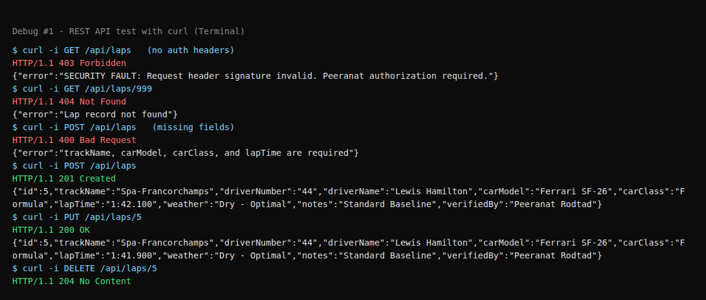
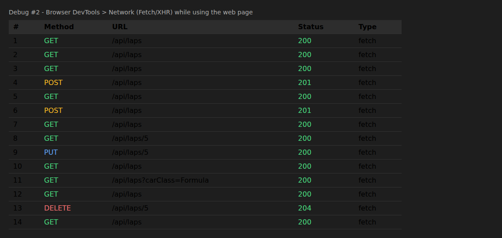
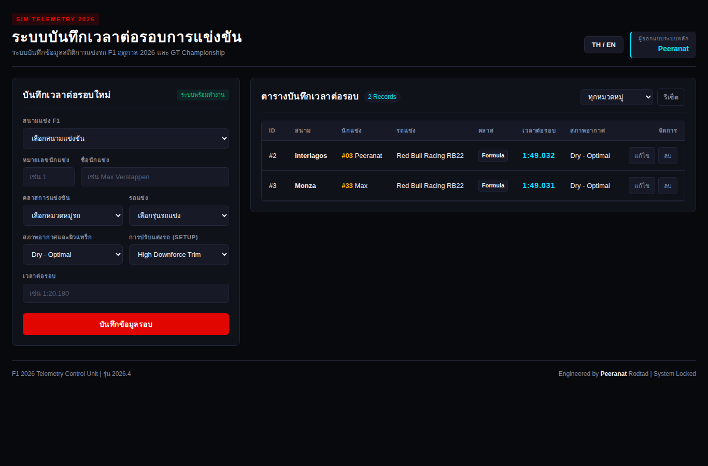
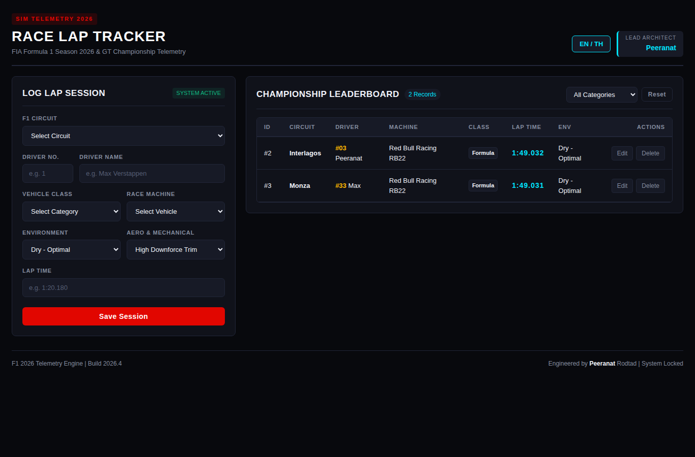
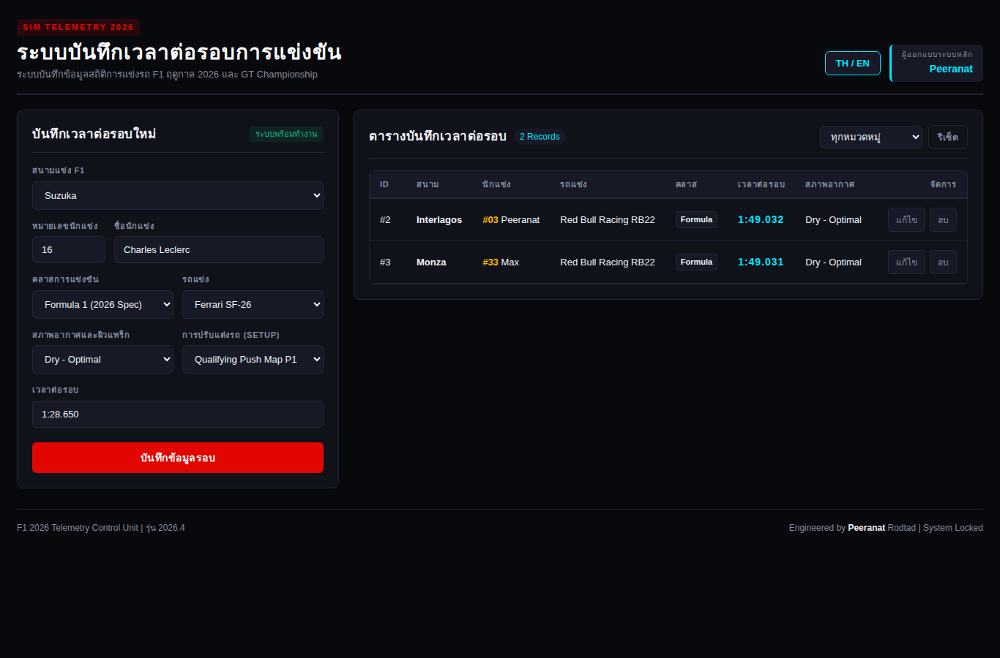
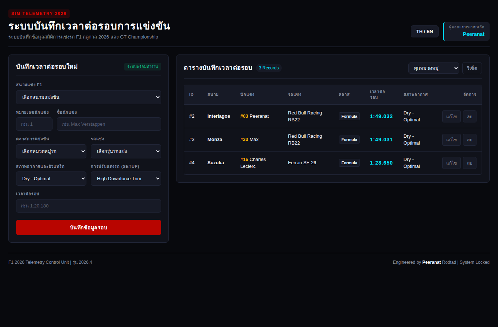
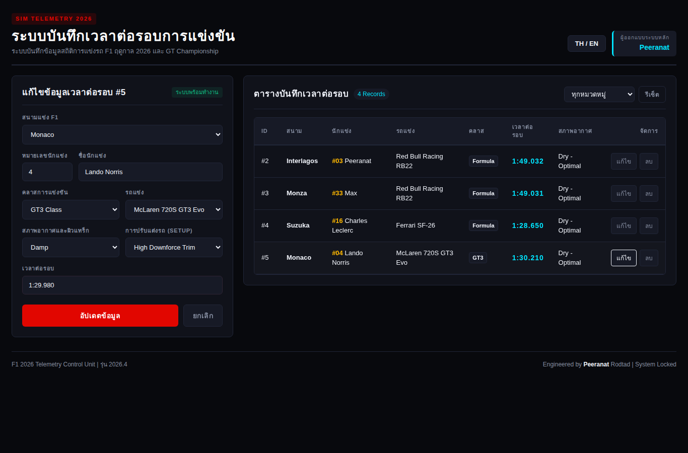
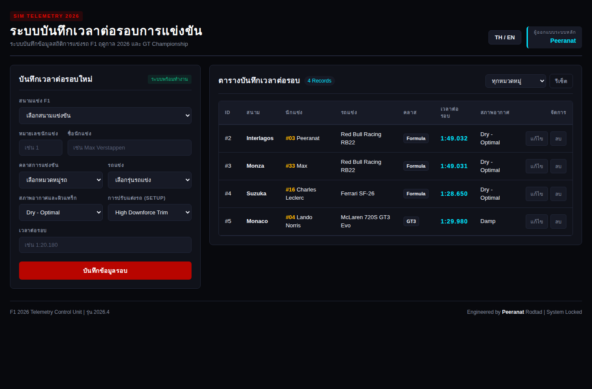

# 🏁 Race Lap Tracker

เว็บแอปบันทึกเวลาต่อรอบการแข่งขัน (F1 / GT3 / GT4 / Hypercar / TCR) สร้างด้วย **Node.js + Express** ฝั่งเซิร์ฟเวอร์เป็น REST API ที่เก็บข้อมูลในไฟล์ JSON ส่วนฝั่งไคลเอนต์เป็น HTML + CSS + JavaScript ล้วน ที่เรียก API ของตัวเองด้วย `fetch()` และอัปเดตหน้าเว็บทันทีโดยไม่ต้องรีเฟรช

> 📄 รายงานฉบับเต็มพร้อม screenshots: [`docs/Report.pdf`](docs/Report.pdf)

## ✨ ความสามารถ

| ฟีเจอร์ | วิธีทำงาน |
|---|---|
| แสดงรายการ | `GET /api/laps` ผ่าน `fetch()` แล้ววาดตาราง (เดสก์ท็อป) / การ์ด (มือถือ) |
| เพิ่มรายการ | ฟอร์ม → `POST /api/laps` → รายการอัปเดตทันที |
| แก้ไขรายการ | ปุ่ม "แก้ไข" → `GET /api/laps/:id` เติมฟอร์ม → `PUT /api/laps/:id` |
| ลบรายการ | ปุ่ม "ลบ" + ยืนยัน → `DELETE /api/laps/:id` |
| กรองตามคลาส | `GET /api/laps?carClass=Formula` |
| สลับภาษา | ไทย / อังกฤษ |
| Responsive | แสดงผลเป็นตารางบนจอใหญ่ และเป็นการ์ด + แท็บบนมือถือ |

ฝั่งไคลเอนต์เรียกเฉพาะ API ของตัวเอง (`/api/laps`) เท่านั้น ไม่มีการดึงข้อมูลจาก API ภายนอก (มีเพียงการโหลดฟอนต์ Google Fonts สำหรับตกแต่งหน้าตา ซึ่งไม่ใช่ข้อมูลของแอป และถ้าโหลดไม่ได้ก็จะใช้ฟอนต์สำรอง)

## 📁 โครงสร้างโปรเจกต์

```
Race Lap Tracker/
├── server/                 # ฝั่งเซิร์ฟเวอร์
│   ├── index.js            # จุดเริ่มต้น Express, เสิร์ฟ /public และ mount /api/laps
│   ├── routes/laps.js      # REST API ทั้งหมด (CRUD)
│   └── data/laps.json      # ที่เก็บข้อมูล
├── public/                 # ฝั่งไคลเอนต์
│   ├── index.html
│   ├── style.css
│   └── app.js              # fetch() GET / POST / PUT / DELETE
├── docs/
│   ├── Report.pdf          # รายงาน
│   └── screenshots/        # ภาพหน้าจอประกอบรายงาน
├── package.json
└── README.md
```

## 🚀 วิธีติดตั้งและรัน

ต้องมี [Node.js](https://nodejs.org) เวอร์ชัน 18 ขึ้นไป (สคริปต์ `dev` ใช้ `node --watch`)

```bash
# 1. ติดตั้ง dependencies
npm install

# 2. รันโหมดพัฒนา (รีสตาร์ทอัตโนมัติเมื่อแก้ไฟล์)
npm run dev

# หรือรันแบบปกติ
npm start
```

จากนั้นเปิดเบราว์เซอร์ที่ <http://localhost:3000> (เปลี่ยนพอร์ตได้ด้วย `PORT=4000 npm start`)

## 🔌 รายการ Endpoint

Base URL: `http://localhost:3000/api/laps`

| Method | Path | คำอธิบาย | สถานะที่ตอบกลับ |
|---|---|---|---|
| GET | `/api/laps` | ดึงรายการทั้งหมด (รองรับ `?carClass=` และ `?track=`) | 200 |
| GET | `/api/laps/:id` | ดึงรายการเดียวตาม id | 200, 404 |
| POST | `/api/laps` | เพิ่มรายการใหม่ | 201, 400 |
| PUT | `/api/laps/:id` | แก้ไขรายการ | 200, 400, 404 |
| DELETE | `/api/laps/:id` | ลบรายการ | 204, 404 |

ทุก request ไปยัง `/api/laps` ต้องแนบ header ตามที่ middleware `enforceDeveloperIntegrity` กำหนด ไม่เช่นนั้นจะได้ `403 Forbidden`:

```
X-Author-Sign: Peeranat
X-Developer-Full: Peeranat Rodtad
```

(หน้าเว็บแนบ header เหล่านี้ให้อัตโนมัติ)

### โครงสร้างข้อมูล (JSON)

```json
{
  "id": 4,
  "trackName": "Suzuka",
  "driverNumber": "16",
  "driverName": "Charles Leclerc",
  "carModel": "Ferrari SF-26",
  "carClass": "Formula",
  "lapTime": "1:28.650",
  "weather": "Dry - Optimal",
  "notes": "Qualifying Push Map P1",
  "verifiedBy": "Peeranat Rodtad"
}
```

ฟิลด์ที่จำเป็นสำหรับ POST / PUT: `trackName`, `carModel`, `carClass`, `lapTime`

### ตัวอย่างการเรียกด้วย curl

```bash
curl http://localhost:3000/api/laps \
  -H "X-Author-Sign: Peeranat" -H "X-Developer-Full: Peeranat Rodtad"

curl -X POST http://localhost:3000/api/laps \
  -H "Content-Type: application/json" \
  -H "X-Author-Sign: Peeranat" -H "X-Developer-Full: Peeranat Rodtad" \
  -d '{"trackName":"Monza","carModel":"Ferrari SF-26","carClass":"Formula","lapTime":"1:21.500"}'
```

## 🐞 ภาพหลักฐานการดีบัก

**ภาพที่ 1 – ทดสอบ API ด้วย curl** (ครอบคลุมทั้งกรณีสำเร็จ 200/201/204 และกรณีผิดพลาด 400/403/404)



**ภาพที่ 2 – Network log ของการเรียก `fetch()` จากหน้าเว็บ** (GET / POST / PUT / DELETE โดยไม่มีการโหลดหน้าใหม่)



## 🖼️ Screenshots

| รายการ (ไทย) | รายการ (อังกฤษ) |
|---|---|
|  |  |
| กรอกฟอร์มเพิ่ม | หลังเพิ่ม (อัปเดตทันที) |
|  |  |
| โหมดแก้ไข | หลังแก้ไข |
|  |  |

ดูภาพทั้งหมด (ฟิลเตอร์ ลบ มือถือ ฯลฯ) ได้ใน [`docs/Report.pdf`](docs/Report.pdf)

## 📝 หมายเหตุ

- โปรเจกต์นี้ต้องรันเซิร์ฟเวอร์ Node.js จึง **ไม่สามารถใช้ GitHub Pages ได้** ให้โคลน repository แล้วรันบนเครื่องตามขั้นตอนข้างต้น
- ข้อมูลเก็บใน `server/data/laps.json` และจะถูกเขียนทับเมื่อมีการเพิ่ม/แก้ไข/ลบ
- ข้อกำหนดข้อ "PATCH/PUT": โปรเจกต์นี้ใช้ **PUT** สำหรับการแก้ไข
